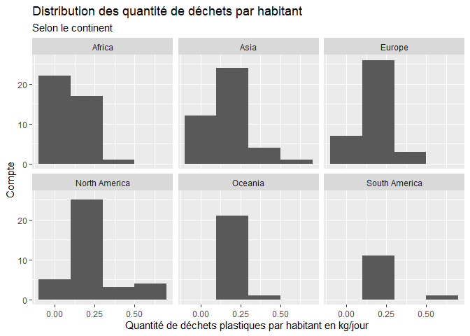
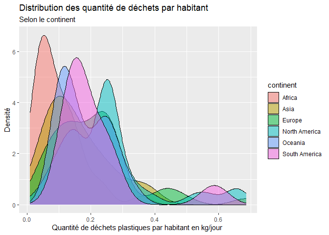

Lab 02 - Plastic waste
================
Votre nom
La date

## Chargement des packages et des données

``` r
library(tidyverse) 
```

``` r
plastic_waste <- read_csv("data/plastic-waste.csv")
```

Commençons par filtrer les données pour retirer le point représenté par
Trinité et Tobago (TTO) qui est un outlier.

``` r
plastic_waste <- plastic_waste %>%
  filter(plastic_waste_per_cap < 3.5)
```

## Exercices

### Exercise 1

``` r
ggplot(data = plastic_waste, aes(x = plastic_waste_per_cap)) +
  geom_histogram(binwidth = 0.2) +
  facet_wrap( ~continent , ncol = 3)
```

<!-- -->

### Exercise 2

``` r
ggplot(data = plastic_waste, aes(x = plastic_waste_per_cap,
                                 fill = continent)) +
  geom_density(alpha = 0.5) 
```

<!-- -->

Réponse à la question…

Car color et fill servent à derterminer la propriété en fonction des
données soit ici les continents et le plastic_waster_per_cap tandis que
alpha lui sert fixer la transparence peu importe la variable dans les
données.

### Exercise 3

Boxplot:

``` r
# insert code here
```

Violin plot:

``` r
# insert code here
```

Réponse à la question…

### Exercise 4

``` r
# insert code here
```

Réponse à la question…

### Exercise 5

``` r
# insert code here
```

``` r
# insert code here
```

Réponse à la question…

## Conclusion

Recréez la visualisation:

``` r
# insert code here
```
